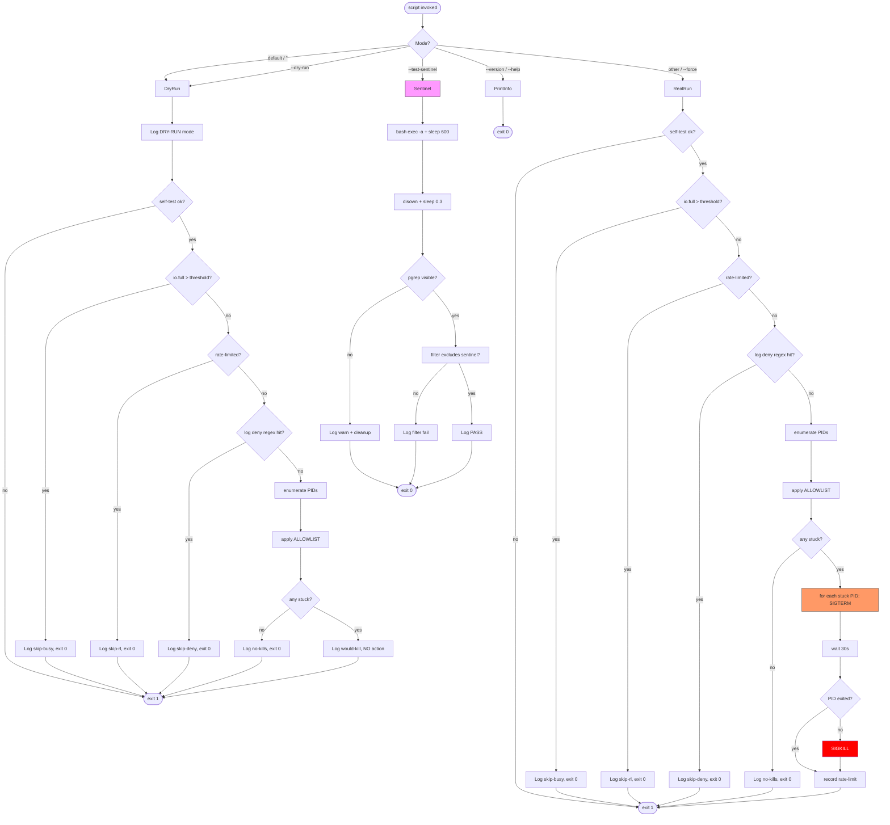

```mermaid
flowchart TD
    Start([script invoked]) --> Mode{Mode?}

    Mode -->|default / ''| DryRun
    Mode -->|--dry-run| DryRun
    Mode -->|--test-sentinel| Sentinel
    Mode -->|--version / --help| PrintInfo
    Mode -->|other / --force| RealRun

    DryRun --> LogDry[Log DRY-RUN mode]
    Sentinel --> SpawnFake[bash exec -a + sleep 600]
    SpawnFake --> DisownS[disown + sleep 0.3]
    DisownS --> CheckSentinel{pgrep visible?}
    CheckSentinel -->|no| LogFail[Log warn + cleanup]
    CheckSentinel -->|yes| VerifyFilter[filter excludes sentinel?]
    VerifyFilter -->|no| LogFilterFail[Log filter fail]
    VerifyFilter -->|yes| LogPass[Log PASS]
    LogFail --> EndS([exit 0])
    LogFilterFail --> EndS
    LogPass --> EndS

    LogDry --> SelfTest{self-test ok?}
    SelfTest -->|no| EndD([exit 1])
    SelfTest -->|yes| PsiD{io.full > threshold?}
    PsiD -->|yes| SkipBusyD[Log skip-busy, exit 0]
    PsiD -->|no| RateLimitD{rate-limited?}
    RateLimitD -->|yes| SkipRLD[Log skip-rl, exit 0]
    RateLimitD -->|no| ReadLogD{log deny regex hit?}
    ReadLogD -->|yes| SkipLogD[Log skip-deny, exit 0]
    ReadLogD -->|no| EnumD[enumerate PIDs]
    EnumD --> FilterD[apply ALLOWLIST]
    FilterD --> StuckD{any stuck?}
    StuckD -->|no| LogNoKillD[Log no-kills, exit 0]
    StuckD -->|yes| LogWouldKillD[Log would-kill, NO action]
    LogWouldKillD --> EndD

    PrintInfo --> EndP([exit 0])

    RealRun --> SelfTestR{self-test ok?}
    SelfTestR -->|no| EndR([exit 1])
    SelfTestR -->|yes| PsiR{io.full > threshold?}
    PsiR -->|yes| SkipBusyR[Log skip-busy, exit 0]
    PsiR -->|no| RateLimitR{rate-limited?}
    RateLimitR -->|yes| SkipRLR[Log skip-rl, exit 0]
    RateLimitR -->|no| ReadLogR{log deny regex hit?}
    ReadLogR -->|yes| SkipLogR[Log skip-deny, exit 0]
    ReadLogR -->|no| EnumR[enumerate PIDs]
    EnumR --> FilterR[apply ALLOWLIST]
    FilterR --> StuckR{any stuck?}
    StuckR -->|no| LogNoKillR[Log no-kills, exit 0]
    StuckR -->|yes| Kill[for each stuck PID: SIGTERM]
    Kill --> WaitGrace[wait 30s]
    WaitGrace --> CheckExit{PID exited?}
    CheckExit -->|yes| Record[record rate-limit]
    CheckExit -->|no| Kill9[SIGKILL]
    Kill9 --> Record
    Record --> EndR

    SkipBusyD --> EndD
    SkipRLD --> EndD
    SkipLogD --> EndD
    LogNoKillD --> EndD
    SkipBusyR --> EndR
    SkipRLR --> EndR
    SkipLogR --> EndR
    LogNoKillR --> EndR

    style Sentinel fill:#f9f,stroke:#333
    style Kill fill:#f96,stroke:#333
    style Kill9 fill:#f00,color:#fff
```
