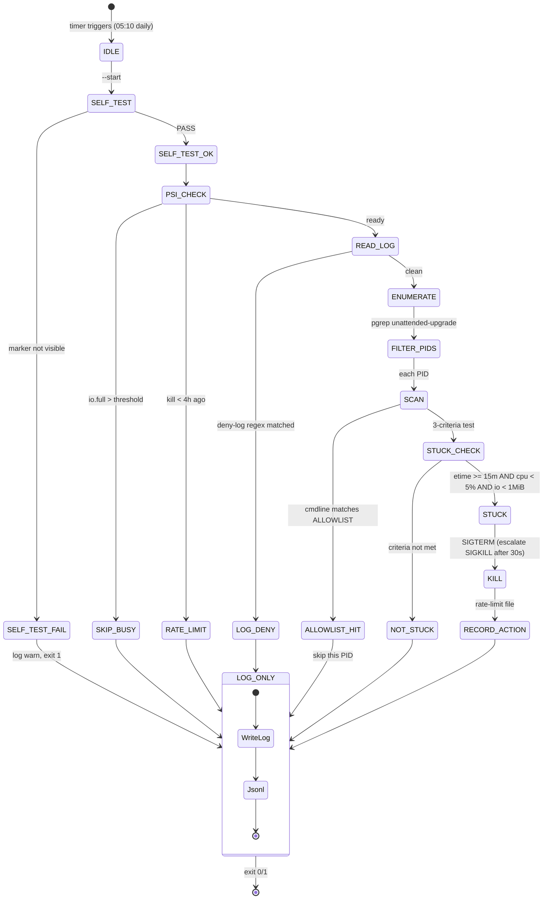

```mermaid
stateDiagram-v2
    [*] --> IDLE: timer triggers (05:10 daily)

    IDLE --> SELF_TEST: --start

    SELF_TEST --> SELF_TEST_FAIL: marker not visible
    SELF_TEST --> SELF_TEST_OK: PASS

    SELF_TEST_FAIL --> LOG_ONLY: log warn, exit 1
    SELF_TEST_OK --> PSI_CHECK

    PSI_CHECK --> SKIP_BUSY: io.full > threshold
    PSI_CHECK --> RATE_LIMIT: kill < 4h ago
    PSI_CHECK --> READ_LOG: ready

    SKIP_BUSY --> LOG_ONLY
    RATE_LIMIT --> LOG_ONLY

    READ_LOG --> LOG_DENY: deny-log regex matched
    READ_LOG --> ENUMERATE: clean

    LOG_DENY --> LOG_ONLY

    ENUMERATE --> FILTER_PIDS: pgrep unattended-upgrade
    FILTER_PIDS --> SCAN: each PID

    SCAN --> ALLOWLIST_HIT: cmdline matches ALLOWLIST
    SCAN --> STUCK_CHECK: 3-criteria test

    ALLOWLIST_HIT --> LOG_ONLY: skip this PID

    STUCK_CHECK --> STUCK: etime >= 15m AND cpu < 5% AND io < 1MiB
    STUCK_CHECK --> NOT_STUCK: criteria not met

    NOT_STUCK --> LOG_ONLY

    STUCK --> KILL: SIGTERM (escalate SIGKILL after 30s)
    KILL --> RECORD_ACTION: rate-limit file
    RECORD_ACTION --> LOG_ONLY

    LOG_ONLY --> [*]: exit 0/1

    state LOG_ONLY {
        [*] --> WriteLog
        WriteLog --> Jsonl
        Jsonl --> [*]
    }
```
